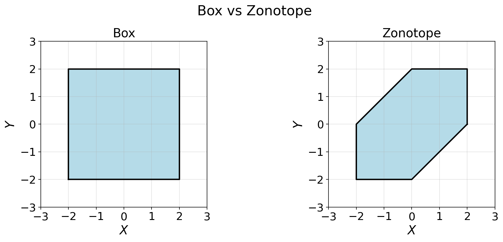

# Interval-extended congruency tests

This repository provides simulation code and the companion paper for **classical** vs **interval-extended** congruency tests that explicitly account for *remaining systematic effects* as **unknown-but-bounded** biases.

**Paper (IVK 2026 proceedings)**  
- *Beyond a Pure Stochastic Treatment: Integrating Remaining Systematics into Congruency Tests*  
  Reza Naeimaei, Steffen Schön  
  DOI: `10.3217/978-3-99161-070-0-013` (see [`Paper/ivk_2026_013.pdf`](Paper/ivk_2026_013.pdf))

---

## Repository structure

- `1D_Case/` — 1D simulations (classical vs interval-extended with **box** bias)
- `2D_Case/` — 2D simulations (classical vs interval-extended with **box**/**zonotope** bias)
- `Paper/` — final PDF corresponding to the simulation study
- `docs/` — additional figures used in the README and geometric intuition (Minkowski sum/difference) with figures/animations

Each simulation folder includes an `outputs/` directory containing generated figures and cached result files (`.npz`) produced by the scripts.

---

## Requirements

- Python **>= 3.9**
- Packages: `numpy`, `scipy`, `matplotlib`, `tqdm`, `joblib`

Install with pip:

```bash
python -m venv .venv
# Windows: .venv\Scripts\activate
# macOS/Linux: source .venv/bin/activate
pip install -r requirements.txt
```

---

## Main idea

Classical congruency tests evaluate significance under a **purely stochastic** model. In millimetre-level deformation monitoring, however, *remaining systematic effects* (e.g., residual registration artefacts, incidence-angle dependent effects, atmospheric variability) can be of the same order as the deformation signal. Neglecting these effects may therefore lead to **overly optimistic binary decisions**.

We extend the congruency test by separating uncertainty into:
- a **stochastic part** (covariance-based), and
- a **bounded systematic part** represented by an admissible set $\(B\subset\mathbb{R}^2\)$.

In practice, remaining systematic errors are commonly represented by either an axis-aligned **box** or a generator-based **zonotope**.

### Box and zonotope models for remaining systematics

**Box (interval product / axis-aligned bounds)**

$$
B_{\mathrm{box}} = [x_{\min},x_{\max}] \times [y_{\min},y_{\max}] \subset \mathbb{R}^2.
$$

**Zonotope (generator-based bounded set)**

$$
B_{\mathrm{zono}} = \{G\zeta : \zeta \in [-1,1]^p\}
= \{\sum_{i=1}^{p}\zeta_i g^{(i)} : \zeta_i \in [-1,1]\}.
$$

The figure below illustrates these two admissible set models (used here as *examples*):



### How the sets enter the interval-extended test

Let $\(\mathbf d\in\mathbb{R}^2\)$ be the observed displacement between two epochs. We use the additive model

$$
\mathbf d = \boldsymbol{\mu}_d + \mathbf b + \mathbf e,
\qquad
\mathbf e \sim \mathcal N(\mathbf 0,\Sigma_d),
\qquad
\mathbf b \in B .
$$

where the admissible bias set $\(B\subset\mathbb{R}^2\)$ is modelled either as a box or as a zonotope.
- $$B = B_{\mathrm{box}}$$ (box model)
- $$B = B_{\mathrm{zono}}$$ (zonotope model)


The classical quadratic-form statistic is

$$
T_{\mathrm{cls}} = \mathbf d^\top \Sigma_d^{-1}\mathbf d .
$$

In the interval extension, the bias is unknown but bounded, so we evaluate

$$
T_{\mathrm{ext}}(\mathbf b) = (\mathbf d-\mathbf b)^\top \Sigma_d^{-1}(\mathbf d-\mathbf b),
\qquad \mathbf b\in B,
$$

which yields an interval-valued statistic

$$
[T] = [T_{\min},T_{\max}],
\qquad
T_{\min}=\min_{\mathbf b\in B}T_{\mathrm{ext}}(\mathbf b),
\quad
T_{\max}=\max_{\mathbf b\in B}T_{\mathrm{ext}}(\mathbf b).
$$

This induces a three-valued decision rule (strict accept / reject / ambiguous), as described in the paper.

---

## Geometric intuition: Minkowski sum and difference (2D)

In 2D, the classical acceptance region is the ellipse

$$
E = \{\mathbf d : \mathbf d^\top \Sigma_d^{-1}\mathbf d \le k_\alpha\}.
$$

When remaining systematics are modelled by a bounded set \(B\) (box or zonotope), the interval extension admits a transparent geometric interpretation via Minkowski operations:

$$
A_{\mathrm{ext}} = E \oplus B,
\qquad
A_{\mathrm{in}} = E \ominus B,
\qquad
A_{\mathrm{amb}} = A_{\mathrm{ext}} \setminus A_{\mathrm{in}} .
$$

See [`docs/`](docs/) for animations and a short explanation of Minkowski sum/difference and how they relate to the inner/outer/ambiguity regions.


---

## Reproducing the simulations

### 1D
```bash
python 1D_Case/01_classic_1D.py
python 1D_Case/02_extended_box_1D.py
```

### 2D
```bash
python 2D_Case/01_classic_2D.py
python 2D_Case/02_extended_box_2D.py
python 2D_Case/03_extended_zonotope_2D.py
```

The scripts write figures to the corresponding `*/outputs/` folders.

---

## Further reading (set representations)

For additional background on set representations (boxes, zonotopes) and set-based operations, the **CORA** documentation is a good reference:  
https://tumcps.github.io/CORA/

---

## License

- **Code:** MIT License (see `LICENSE`).
- **Paper PDF:** includes its own license statement inside the document (CC BY 4.0 for the paper content).
