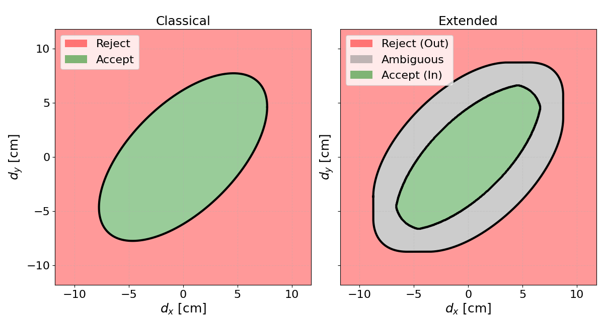

# Interval-extended congruency tests (TLS deformation monitoring)

This repository contains the simulation code and the corresponding paper for **classical** vs **interval-extended** congruency tests that explicitly account for *remaining systematic effects* as **unknown-but-bounded** biases.

**Paper (IVK 2026 proceedings):**
- *Beyond a Pure Stochastic Treatment: Integrating Remaining Systematics into Congruency Tests*  
  Reza Naeimaei, Steffen Schön  
  DOI: `10.3217/978-3-99161-070-0-013` (see [`Paper/ivk_2026_013.pdf`](Paper/ivk_2026_013.pdf))

## Repository structure

- `1D_Case/` – 1D simulations (classical and interval-extended **box** bias model)
- `2D_Case/` – 2D simulations (classical and interval-extended **box**/**zonotope** bias models)
- `Paper/` – final PDF corresponding to the simulation study
- `docs/minkowski/` – geometric intuition (Minkowski sum/difference) with figures/animations

Each simulation folder includes an `outputs/` directory containing generated figures and cached result files (`.npz`) produced by the scripts and used for the paper.

## Requirements

- Python **>= 3.9**
- Packages: `numpy`, `scipy`, `matplotlib`, `tqdm`, `joblib`

Install with pip:
```bash
python -m venv .venv
# Windows: .venv\Scripts\activate
# macOS/Linux: source .venv/bin/activate
pip install -r requirements.txt
```

## Main idea

Classical congruency tests evaluate significance under a **purely stochastic** model. At millimetre-level deformation monitoring, however, *remaining systematic effects* (e.g., residual registration artefacts, incidence-angle dependent effects, atmospheric variability) can be of the same order as the deformation signal. Neglecting these effects may therefore lead to **overly optimistic binary decisions**.

In this repository, we demonstrate via simulations how ignoring remaining systematic errors changes the decision behaviour of the classical test, and how incorporating them through an **interval-extended congruency test** yields robust and interpretable decisions. Remaining systematics are modelled as an admissible bounded set \(B\), represented either as an axis-aligned **box** or as a generator-based **zonotope**.



## Geometric intuition: Minkowski sum and difference (2D)

In the 2D interval-extended congruency test, remaining systematic effects are modelled as an admissible bounded set \(B\) (axis-aligned **box** or **zonotope**). The classical acceptance region is the ellipse

$E = \{\mathbf d : \mathbf d^\top \Sigma_d^{-1}\,\mathbf d \le k_\alpha\}.$

The extended decision regions follow directly from Minkowski operations:

- Robust outer boundary: $\(A_{\mathrm{ext}} = E \oplus B\)$
- Strict-accept region: $\(A_{\mathrm{in}} = E \ominus B\)$
- Ambiguity region: $\(A_{\mathrm{amb}} = A_{\mathrm{ext}} \setminus A_{\mathrm{in}}\)$

See [`docs/minkowski/`](docs/minkowski/) for animations and a short mathematical explanation.

## Reproducing the simulations

### 1D
```bash
python 1D_Case/01_classic_1D.py
python 1D_Case/02_extended_box_1D.py
```

### 2D
```bash
python 2D_Case/01_classic_2D.py
python 2D_Case/02_extended_box_2D.py
python 2D_Case/03_extended_zonotope_2D.py
```

The scripts write figures to the corresponding `*/outputs/...` folders.

## License

- **Code:** MIT License (see `LICENSE`).
- **Paper PDF:** includes its own license statement inside the document (CC BY 4.0 for the paper content).
