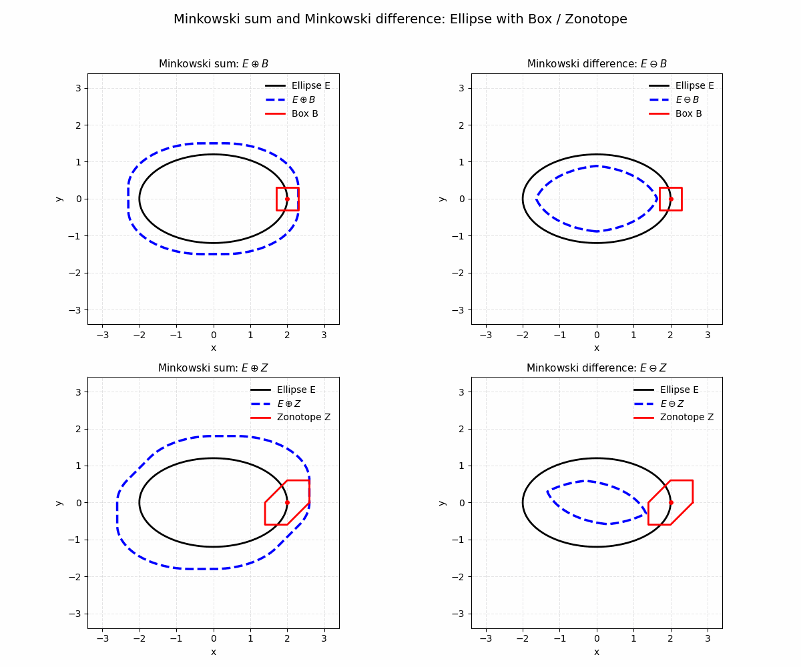

# Minkowski operations for the interval-extended congruency test (2D)

This folder provides figures and animations that explain the geometric interpretation of the **interval-extended congruency test** in 2D.

## Why Minkowski operations appear

Let the classical acceptance region be the ellipse

\[
E = \{\mathbf d : \mathbf d^\top \Sigma_d^{-1}\,\mathbf d \le k_\alpha\}.
\]

Remaining systematic effects are treated as **unknown-but-bounded** biases \(\mathbf b\in B\), where \(B\subset\mathbb R^2\) is an admissible set.
In the paper and simulations, we consider:

- **Box model**: axis-aligned bounds in \((b_x,b_y)\)
- **Zonotope model**: generator-based bounds that can encode preferred directions and dependencies

## Definitions

For sets \(A,B\subset\mathbb R^2\):

- **Minkowski sum**:  \(A \oplus B = \{a+b : a\in A,\; b\in B\}\)
- **Minkowski (Pontryagin) difference**: \(A \ominus B = \{x : x + B \subseteq A\}\)

## Decision regions (geometric interpretation)

Using the same critical value \(k_\alpha\) as the classical test, the interval extension induces:

- **Outer region**: \(A_{\mathrm{ext}} = E \oplus B\)  
  Outside \(A_{\mathrm{ext}}\), deformation cannot be explained by any admissible bias → **robust reject**.

- **Inner region**: \(A_{\mathrm{in}} = E \ominus B\)  
  Inside \(A_{\mathrm{in}}\), the observation stays inside \(E\) for all admissible biases → **strict accept**.

- **Ambiguity region**: \(A_{\mathrm{amb}} = A_{\mathrm{ext}} \setminus A_{\mathrm{in}}\)  
  Bias and deformation are not separable without additional information → **ambiguous**.

## Figures

> Note: The animation shows a progressive construction (approximation) of the Minkowski sum/difference by sampling boundary points.

### Classical vs extended acceptance regions

### Minkowski sum/difference with box and zonotope (animation)

